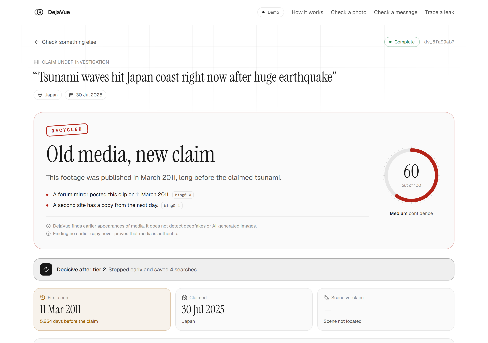

# DejaVue

**Was this photo really taken where and when the post says?** DejaVue answers that using SerpApi's search engines as a timestamped archive of the web — and shows you every result it used to decide.

It also checks the text scams people act on fastest: **fake job offers, government scheme messages and customer-care numbers** (see [Offer Check](#offer-check)), and traces **leaked documents shared as images** to where and when public copies of them appeared (see [Leak trace](#leak-trace)).

Searches escalate in tiers and stop the moment the evidence is decisive, so **a recycled photo usually costs 1 SerpApi search and the hardest case costs 6.**

Built for the SerpApi India Hackathon 2026 (Knowledge & Public Interest track).

## One case, end to end

> A video is going around captioned *"Tsunami waves hit Japan coast right now after huge earthquake"*, dated 30 July 2025.

```
Tier 1  Google Lens (exact matches) ────────── 1 search
        socialclip.example  ·  no date on the page
        ↳ thumbnail re-hashed: Hamming 2 of 64 → same video

Tier 2  Bing Reverse Image ─────────────────── 1 search
        forum-mirror.example    2011-03-11   ISO date on the page
        regional-daily.example  2011-03-12   ISO date on the page
        ↳ two independent domains, one day apart → T₀ = 11 March 2011

        Decisive. Yandex is never searched.

╭──────────────────────────────────────────────────────────╮
│  RECYCLED                              confidence 60 Med │
│  This footage was published in March 2011, long before   │
│  the claimed tsunami.                                    │
│                                                          │
│  +15 ×3  confirmed visual match (3 domains)              │
│  +15     matches from 2+ independent search indexes      │
╰──────────────────────────────────────────────────────────╯

2 SerpApi searches spent. 4 of the 6-search cap unused.
```

Every number on that card traces to a labelled reason, and every reason traces to a search result you can click. That is the whole design.

The result page leads with the verdict, the plain-language explanation and the evidence. The working behind it — the score breakdown, the searches spent, which engines answered, the signed dossier — sits one click away under **Show the working**, so nothing is hidden and nothing is in the way.



That capture is generated, not pasted: `npm run build`, `npm start -- -p 3123`, then `npm run screenshots` re-renders it from the live app, so it cannot drift from what the code does. ([the whole page](docs/images/audit-full.png), including the evidence feed and the timeline.)

## Run it locally

```bash
npm install
cp .env.example .env.local   # FIXTURE_MODE=replay needs no keys
npm run dev                  # http://localhost:3000
```

Replay mode runs the whole pipeline on recorded search results and uses **zero SerpApi credits**. Pick a demo case on `/check` to watch a check stream in. The pipeline itself judges a media audit in single-digit milliseconds, so each replayed search and model call waits `REPLAY_PACE_MS` (default 180 ms) to keep the staged progress visible; set it to 0 for instant results, or higher when recording a walkthrough.

```bash
npm test            # 236 tests: 12 media and 6 offer golden cases, verdict rules,
                    # failure scenarios, extraction, stores and pHash
npm run test:live   # 4 real end-to-end checks against SerpApi + Gemini (~8 searches)
npm run typecheck
npm run build
npm run screenshots # re-render the README image from a running build
```

`npm run test:live` is the one that matters for trusting any of this. `tests/offer-live-regressions.test.ts` holds seven tests, each pinning down something a real September 2026 run against SerpApi and Gemini got wrong — `.bank.in` domains read as "bank", missing knowledge graphs, an organisation's own second domain flagged as unofficial.

## Verdicts

The names on the left are internal. A reader only ever sees the middle column — `lib/client/labels.ts` is the single place the two are joined, and a test fails if any verdict reaches the screen as its constant.

| Verdict | Shown as | Meaning |
| --- | --- | --- |
| `RECYCLED` | **Old media, new claim** | A confirmed copy was online more than 48 hours before the claimed date |
| `MISPLACED` | **Wrong location** | The scene resolves too far from the claimed place (50 km city, 300 km region, country boundary) |
| `CONSISTENT` | **Matches its claim** | The earliest confirmed copies match the claimed time, and the scene was located close to the claimed place |
| `CONTEXT_PLAUSIBLE` | **Event is real, image unproven** | No earlier copy, but news corroborates the claimed event |
| `UNVERIFIED` | **Not enough evidence** | Finding nothing never counts as proof of authenticity |

Confidence (0–100) is additive over the evidence and capped per verdict. The dossier lists every point.

### Calling something recycled is an accusation, so it needs a claim to contradict

If you upload a genuine 2019 photo, describe it honestly and leave the date box empty, the claimed date defaults to *now* — and a naive rule would stamp **RECYCLED** on it at high confidence. That is a false accusation produced by our own default, not by anything the user said.

So `RECYCLED` additionally requires that the claim asserts a date at all: either you gave one, or the text itself puts the media in the present (`today`, `breaking`, `right now`, `abhi`, `aaj`, …), matched by a plain regex — not by the language model. When no date is asserted but an older copy exists, the finding is kept and the accusation is dropped: the flag `predatesClaim` stays true and the result reads *"This media was already online on 2019-06-01. Nothing was claimed about its date."*

## How SerpApi is used

| Tier | Engine | Question it answers |
| --- | --- | --- |
| 1 | Google Lens (exact matches) | Has this exact image been published before? |
| 2 | Bing Reverse Image, Yandex Images | Do independent indexes agree, or know older copies? |
| 3 | Google News | Did the claimed event happen at that time and place? |
| 3 | Google Maps | Where are the claimed place and the landmark in the scene? |
| 3 | YouTube | Was this footage uploaded earlier? (video, or a broadcast logo) |
| 3 | Google Search (date-restricted) | When was an undated matching page published? |

A search result only counts as a visual match after DejaVue re-hashes its thumbnail and finds it within Hamming distance 10 of the input (64-bit DCT pHash). This is what stops a merely *similar* image counting as the same one, which matters because Bing's `related_content` and Yandex's `similar_images` are exactly that.

What each engine can and cannot tell us, from [its documented response shape](docs/research/serpapi-engine-inputs.md):

| Engine | Confirms a copy | Dates it |
| --- | --- | --- |
| Google Lens `exact_matches` | yes | weakly — the date is a relative string ("2 years ago") and present on roughly a third of results |
| Bing `pages_with_this_image` | yes | an ISO 8601 date on every documented sample — but SerpApi never says whether it is a publish or a crawl date, so it is recorded at text trust, not as page metadata |
| Yandex `image_results` | yes | **never** — no date field exists on any documented response |

T₀ (first-seen) therefore leans on Bing, needs two independent domains within 30 days or one trusted archive, and drops relative dates entirely whenever an absolute one is available.

Nothing in the score rewards `dateTrust: 'metadata'`. Only Google News carries a real publish-date field, and a news article is never a confirmed visual match, so the earliest match can never reach that trust level — a scoring reason that cannot fire would make the score look better audited than it is.

## What Gemini does, and what it cannot do

Gemini parses the claim, reads text in the scene and writes the final explanation. **It never scores and never picks the verdict** — `decide()` in `lib/verdict/rules.ts` is a pure function over confirmed evidence, and its output does not depend on any model call succeeding.

That claim is narrower than "the LLM has no influence", so here is the whole truth. Gemini's output reaches the rules in exactly two places, and both are fenced:

| Where | What it could do | What stops it |
| --- | --- | --- |
| `claim.refersToPast` — "this post is openly about an older event" | Clear a genuinely recycled photo | The raw text must independently contain a past cue (a year, `anniversary`, `throwback`, `on this day`, …). A bare hallucinated `true` changes nothing |
| `scene.landmarks[].name` — what the model thinks it can see | Place the scene somewhere wrong, and a wrong location is what `MISPLACED` is built on | Google Maps has to confirm the name it was asked about. `mapsAgrees()` throws away an answer that shares no word with the query, so a landmark the model invented locates nothing |

The model's `confidence` number used to be a gate: below 0.8 and the scene was never looked up at all. That was the wrong thing to trust — it is an uncalibrated figure the model writes about its own guess. It now only *orders* candidates: a landmark it is confident about, then text actually read off a sign, then a landmark it hedged. Words visible in the photo beat a guess the model was unsure of, and Maps decides either way. In `m12` the landmark is 0.6, so the sign text is what gets looked up.

What remains true, and is a real limit: **if the scene reading comes back empty — no landmark, no legible sign — there is nothing to look up, so `MISPLACED` is unreachable for that image.** The dossier then says `location: unchecked` rather than implying agreement, and the audit page prints "Scene not located".

Everything else the model emits is schema-checked with `zod` and falls back to a deterministic template. Narrative bullets that cite an evidence ID which does not exist are dropped, which blocks invented sources, and a narrative whose wording contradicts the verdict is discarded in favour of the template.

EXIF GPS, when you opt in, can locate a scene — but it is a field anyone can edit, so a verdict resting on it alone is docked 20 confidence points and the dossier names the source.

## Offer Check

Paste a message or upload a screenshot. Phones, emails, links, amounts and payment requests are found by patterns, and Gemini only reads the screenshot and names the organisation; anything it quotes must appear in the message word for word. Searches stop as soon as the message is clearly a scam.

| Step | Engine | Question it answers |
| --- | --- | --- |
| 1 | Google Search | What are the organisation's official websites? (the knowledge graph when Google shows one, else results whose domain carries the name, e.g. `sbi.bank.in` and `sbi.co.in`) |
| 2 | Google Search | Is this phone number, email or site reported as a scam on 2+ sites? |
| 3 | Google Jobs (`location=India`) | Does the company really list this job? |
| 3 | Google Search (`site:gov.in`) | Is the scheme on a government website? |
| 3 | Google Search (`site:` the official domain) | Does the official website list this helpline number? |

| Verdict | Shown as | Meaning |
| --- | --- | --- |
| `LIKELY_SCAM` | **Likely a scam** | A strong sign (asks for money, look-alike website, contact reported on 2+ sites), or two medium signs *and* a confirmed official site to contradict |
| `NO_RED_FLAGS` | **No warning signs found** | Official site found, the listing or a contact confirmed on it, and no warning signs. Never "genuine": capped below High confidence |
| `UNVERIFIED` | **Not enough evidence** | Everything else, including when no official site is found |

Two medium signs only add up to a scam verdict when the organisation was actually found. A personal email address is not a warning sign until the sender claims to be TCS, and it is not a *contradiction* until Google has handed us `tcs.com` for the claim to contradict. If no official site turns up, we cannot tell an impersonator from a small firm we simply could not look up, so the answer is `UNVERIFIED` — the same "absence of evidence is not evidence" rule as the media side, applied in the accusing direction.

## Leak trace

Upload a screenshot or photo of a leaked document and say what it is being shared as. DejaVue looks for public copies of the same image, builds a timeline of where and when each one appeared, and compares the full-size copies to say which looks least degraded. Full detail in [docs/LEAK_TRACE.md](docs/LEAK_TRACE.md).

**It never identifies who leaked anything, and says so on every result.** The earliest copy a search engine can see is usually a repost of something first shared in a closed channel, so the answer is always "earliest public appearance found". A narrative that names or implies a person is discarded in favour of the deterministic template, and every result prints the same two lines: *DejaVue finds where public copies appeared. It cannot identify who leaked it.* and *Search engines do not cover private groups, Telegram or dark web forums.*

| Verdict | Shown as | Meaning |
| --- | --- | --- |
| `LEAK_RECYCLED` | **Old leak, shared as new** | A corroborated earliest public copy predates the claimed date by more than 48 h, and the post claims a date or says it is from now |
| `LEAK_EARLIEST_FOUND` | **Earliest public copy found** | A corroborated earliest public copy that does not contradict the claim. Capped at 85: earlier copies may exist where search engines cannot look |
| `LEAK_NOT_FOUND` | **No public copy found** | Nothing corroborated. Capped at 40, because search engines do not index Telegram, private groups, paste sites or dark web forums |

Copies that exist but carry no date are never given one. They are listed apart from the timeline, under *Date unknown*, and the verdict card says *Copies found, none dated* rather than pretending the trace found nothing.

Unlike a media audit, a leak trace does not stop early when the evidence turns decisive: the spread of copies is the answer, so every reverse-image index the budget allows is searched. Two extra searches can date a copy that arrived without one, using that result's own page title - nothing read from the document is ever sent to a search engine.

The **likely closest to the original** panel fetches up to 8 full-size copies (SSRF-guarded, 15 MB cap, no thumbnails - engines resize those) and ranks them by resolution, estimated JPEG quality from the quantisation tables, and how much of the scene each one shows. It is labelled a hint on the page and it never reaches the verdict or the score: a big clean copy can still be a late repost.

## Modes

| `FIXTURE_MODE` | Behaviour |
| --- | --- |
| `replay` (default) | Reads `fixtures/<case>/`. Never calls SerpApi or Gemini |
| `record` | Calls SerpApi for real and saves scrubbed responses as fixtures |
| `live` | Calls SerpApi with a 24 h query cache, media cache and credit ledger |

In `replay` the Upload and Image URL tabs are marked **off** and the demo says so before you fill anything in: the public demo cannot check your own photo, because doing that costs real searches. Run locally with `FIXTURE_MODE=live` and a key to check anything you like.

The home page is prerendered at build time, so its demo cases and the mode badge in the header reflect `FIXTURE_MODE` as it was when you ran `npm run build`. Rebuild after changing it. (On Vercel, changing an environment variable already needs a redeploy.) The API always reads the current value.

Live mode needs `SERPAPI_API_KEY`, `GEMINI_API_KEY` and Supabase Storage for temporary frames. It refuses new audits when fewer than 20 of `MONTHLY_CREDIT_LIMIT` searches remain.

## Caching and storage

| Cache | Kept for | Saves |
| --- | --- | --- |
| SerpApi query cache | 24 h (Google Maps: 30 days, since places don't move) | Paying twice for the same search |
| Media cache (near-identical photo, by pHash) | 7 days | Lens, Bing and Yandex searches, which depend only on the image. A hit reuses them for free and searches only the reverse-image engines still missing. Claim searches (News, Maps, YouTube, dated Search) always run for the new claim, so the verdict is judged fairly. Partial or failed audits are never cached |
| Finished dossiers | 7 days | Reloading a result link |
| Credit ledger | Per calendar month | Enforcing the monthly search budget |

Storage is chosen automatically. With `UPSTASH_REDIS_REST_URL` and `UPSTASH_REDIS_REST_TOKEN` set, it uses Upstash Redis, which serverless hosts such as Vercel need because their local files are wiped. Without them, it uses a local SQLite file in `data/`.

## Deploy to Vercel

1. Import the GitHub repo in Vercel (framework: Next.js; Node 22 is picked up from `engines`).
2. In the project, open **Storage → Create → Upstash → Redis** and connect it. This adds the Redis variables that DejaVue needs on Vercel: live progress, caches, saved results and the rate limit are shared through Redis, because each serverless instance has its own memory and a wiped file system.
3. Add environment variables:
   - `FIXTURE_MODE=replay` for a public demo that never spends SerpApi credits
   - `DOSSIER_HMAC_SECRET` (any long random string)
   - optional `REPLAY_PACE_MS` (default 180)
   - only for live mode: `SERPAPI_API_KEY`, `GEMINI_API_KEY`, `GEMINI_MODEL` and the `SUPABASE_*` variables
4. Deploy.

How it fits serverless: `POST /api/investigate` answers immediately and finishes the audit with Next.js `after()` (up to 60 s). Every audit event is appended to Redis, and `GET /api/investigate/:id/stream` follows that log from any instance, closing before the time limit so the browser reconnects and resumes from `Last-Event-ID`. The demo fixtures are bundled with the functions through `outputFileTracingIncludes`. Without Redis, a deployment falls back to per-instance storage in `/tmp`, where live progress can miss instances.

## About the fixtures

Verdict logic is validated against **12 authored media cases, 6 offer cases and 6 leak cases covering every verdict path**, plus failure scenarios (engine down, budget exhausted, rate limited, deadline hit). They run in CI on every push and spend nothing.

They are authored, not recorded: hand-written in SerpApi's response format so the app and tests run without credits. Outlets use reserved `.example` domains and the scenarios are invented — they are not claims about what real publishers printed. The cases run `m01`–`m12` with no gaps, `o1`–`o6` for offers and `l01`–`l06` for leak traces; frame hashes for `m01`–`m04` come from local test images, which are not committed. Regenerate with `npm run fixtures:author` and `npm run fixtures:leaks`, and replace a case with a recording (`FIXTURE_MODE=record`) once credits are set aside.

The leak fixtures also carry small drawn stand-in documents under `originals/`, resized, recompressed and cropped, so the closest-to-original ranking runs on real pixels without a real leaked document ever being committed.

Because authored fixtures can only ever confirm what the author already believed, the response shapes are checked against SerpApi's docs rather than against the code: see [docs/research/serpapi-engine-inputs.md](docs/research/serpapi-engine-inputs.md). That check is what caught the Bing normalizer reading `related_content` (visually *related* images) instead of `pages_with_this_image` (the exact-match array), and Yandex fixtures carrying dates that Yandex never returns. Both are fixed; both had passed 12 green golden cases. The same check is what fixed Yandex thumbnails, documented as an object (`thumbnail.link`) that the normalizer only read as a string, and it is where the leak ranking's original-image fields come from: Bing's `original`, Yandex's `original_image.link`, and the fact that Google Lens exact matches document no full-size link at all.

## Project layout

```
app/                 pages and API routes (investigate, offer, leak, SSE stream, upload, verify, quota)
components/          audit UI: progress, verdict, timeline, map, evidence
lib/orchestrator/    runAudit: tiered escalation, judging, narration
lib/offer/           runOfferCheck: extraction, reading, domain checks, rules and score
lib/leak/            runLeakTrace: spread timeline, copy ranking, rules and score
lib/serp/            SerpApi client (replay, cache, budget, ledger), engines, normalizer
lib/evidence/        dates and first-seen T₀, geo and ΔS, match confirmation
lib/verdict/         pure verdict rules and score
lib/llm/             Gemini calls with validation and fallbacks
lib/media/           pHash and keyframe scoring (shared by browser and server)
lib/store/           SQLite (node:sqlite) and in-memory stores
fixtures/            golden cases (offers/ for message checks, leaks/ for leak traces)
tests/               tests at the runAudit, runOfferCheck and runLeakTrace seams, plus pure rules and pHash
```

## Decisions that differ from the design doc

| Design doc | Built instead | Why |
| --- | --- | --- |
| `better-sqlite3` + Drizzle | Node's built-in `node:sqlite` | No native build step on any host. Needs Node ≥ 22.13 |
| Cloudflare R2 | Supabase Storage for temporary frames | One less account to provision; 15-minute signed URLs either way |
| shadcn/ui + Zustand | Plain Tailwind components and React state | Smaller bundle, and the audit page has one owner for its state |
| WebCodecs in a worker | `<video>` seeking on the main thread | Works in every browser a judge will open this in |
| One fixture file per request | `serp.json`, `llm.json`, `thumbs.json` per case | A case is reviewable as one diff |

Not built: Google Trends, a Playwright UI test, and the ESLint/Prettier/Husky/gitleaks tooling. There is an extra error code `TIMED_OUT` (504) for when the reverse-image search cannot finish before the audit deadline.
